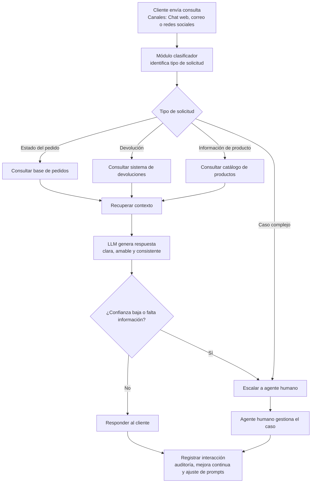

# Taller 1

## Contexto del problema

EcoMarket es una empresa de comercio electrónico enfocada en productos sostenibles que ha experimentado un crecimiento acelerado. Como consecuencia, su área de servicio al cliente enfrenta un cuello de botella debido al alto volumen de consultas recibidas por chat, correo y redes sociales. La mayoría de estas solicitudes corresponden a preguntas repetitivas, como estado de pedidos, devoluciones y características de productos, mientras que una parte menor corresponde a casos complejos que requieren intervención humana. Actualmente, el tiempo promedio de respuesta es de 24 horas, lo que afecta la satisfacción del cliente.

Frente a este escenario, se propone una solución de IA generativa orientada a automatizar la atención de consultas repetitivas, reducir tiempos de respuesta y mejorar la experiencia del cliente, sin eliminar la intervención humana en los casos que exigen empatía, juicio o resolución especializada.

## Fase 1. Selección y justificación del modelo de IA

### 1.1 Modelo propuesto

Para el caso de EcoMarket, la alternativa más adecuada es una  solución híbrida basada en un modelo de lenguaje de propósito general (LLM) integrado con las fuentes de información internas de la empresa y complementado con un mecanismo de escalamiento a agentes humanos . Esta propuesta responde mejor a la naturaleza del problema, ya que la empresa enfrenta un alto volumen de consultas repetitivas sobre estado de pedidos, devoluciones y características de productos, pero también debe atender un conjunto de casos complejos que requieren empatía, criterio y acompañamiento humano.

La elección de una solución híbrida permite combinar dos capacidades esenciales. Por un lado, el modelo generativo aporta comprensión del lenguaje natural, fluidez conversacional y capacidad para responder de manera clara y amable. Por otro, la integración con bases de datos internas garantiza que las respuestas relacionadas con pedidos, devoluciones o productos se construyan a partir de información real y actualizada de EcoMarket, disminuyendo el riesgo de errores o invenciones.

### 1.2 ¿Por qué una solución híbrida y no solo un LLM?

Un modelo de lenguaje sin acceso a datos empresariales no sería suficiente para resolver con precisión las necesidades de EcoMarket. Aunque un LLM generalista puede responder bien preguntas abiertas o generales, no es confiable para temas transaccionales si no consulta directamente la información operativa del negocio. En este caso, responder correctamente sobre estados de envío, políticas de devolución o disponibilidad de productos exige acceso a fuentes actualizadas, ya que estos datos cambian constantemente y no pueden depender solo del conocimiento previo del modelo. El propio taller plantea la necesidad de definir si el modelo se integraría con la base de datos de EcoMarket, lo que confirma que una arquitectura conectada a fuentes empresariales es parte central de la solución esperada.

Asimismo, utilizar únicamente un sistema basado en reglas tampoco sería suficiente, porque aunque podría resolver algunos flujos cerrados, perdería la flexibilidad conversacional necesaria para interactuar de forma natural con los clientes. Por eso, la mejor decisión es combinar capacidades generativas con acceso a datos estructurados y reglas de escalamiento.

### 1.3 Arquitectura propuesta

La arquitectura propuesta para EcoMarket consiste en una solución híbrida de atención al cliente. El flujo inicia cuando el cliente envía una consulta por alguno de los canales disponibles, como chat web, correo electrónico o redes sociales. A continuación, un módulo clasificador identifica automáticamente el tipo de solicitud y determina si corresponde a una consulta sobre estado del pedido, devolución, información de producto o un caso complejo.

Si la consulta pertenece al grupo de solicitudes repetitivas, el sistema consulta la fuente de información correspondiente: la base de pedidos, el sistema de devoluciones o el catálogo de productos. Con esa información recuperada, el modelo de lenguaje genera una respuesta clara, amable y consistente para el cliente. Si la confianza de la respuesta es baja, si falta información o si el caso requiere empatía y criterio humano, la conversación se escala a un agente de servicio al cliente. Finalmente, todas las interacciones se registran para fines de auditoría, mejora continua y ajuste de prompts. Esta arquitectura permite automatizar el 80% de las consultas repetitivas y reservar la atención humana para el 20% de los casos complejos, en línea con la necesidad planteada en el caso de estudio.

#### ¿El modelo se integraría con la base de datos de EcoMarket (catálogo de productos, información de envíos)?

Sí. El modelo debe integrarse con los sistemas internos de EcoMarket, especialmente con la base de pedidos, el sistema de devoluciones y el catálogo de productos. Esta integración es esencial para asegurar que las respuestas entregadas a los clientes sean precisas, consistentes y actualizadas.

Por ejemplo, para una consulta sobre el estado de un pedido, el sistema debe recuperar información real de envío, seguimiento y fecha estimada de entrega. En el caso de devoluciones, debe consultar las políticas vigentes y las condiciones aplicables al producto. Para preguntas sobre productos, debe acceder al catálogo y a sus características. De este modo, el modelo no responde solamente con conocimiento general, sino con datos reales de la empresa, lo que mejora la confiabilidad y reduce el riesgo de alucinaciones.

#### ¿Sería un modelo de propósito general o se afinaría con datos de la empresa?

En una primera etapa, la opción más conveniente es utilizar un modelo de propósito general integrado con la información interna de EcoMarket, en lugar de iniciar con un modelo afinado. Esta decisión se justifica porque un modelo generalista ya posee buenas capacidades de comprensión y generación de lenguaje, y puede producir respuestas naturales y útiles siempre que reciba contexto confiable desde los sistemas empresariales.

Además, esta opción es más flexible y rápida de implementar. El afinamiento con datos de la empresa podría evaluarse más adelante, cuando EcoMarket disponga de suficientes datos históricos limpios y estructurados, y cuando se identifiquen necesidades específicas de personalización que justifiquen esa inversión adicional.

#### Diagrama de flujo de la arquitectura propuesta

### 1.4 Justificación de la elección del modelo

La recomendación de usar un LLM de propósito general conectado a datos internos se sustenta en cuatro criterios principales: costo, escalabilidad, facilidad de integración y calidad de la respuesta esperada, tal como lo solicita el taller.

#### Costo

Desde la perspectiva de costos, esta alternativa es más conveniente que iniciar con un modelo afinado. El fine-tuning exige recopilar y curar grandes volúmenes de datos, preparar conjuntos de entrenamiento, ejecutar procesos de ajuste y mantener versiones del modelo en el tiempo. En cambio, un modelo generalista ya disponible puede empezar a generar valor más rápido si se conecta a las fuentes correctas. Para EcoMarket, que necesita aliviar un cuello de botella operativo en el corto plazo, esta opción resulta más eficiente y realista.

#### Escalabilidad

También es una solución más escalable. A medida que la empresa crezca y cambien su catálogo, políticas o estados logísticos, no será necesario reentrenar el modelo continuamente. Bastará con mantener actualizadas las bases de datos y los sistemas conectados. Esto permite que la solución evolucione junto con la operación del negocio de forma más flexible y sostenible.

#### Facilidad de integración

En términos de integración, un modelo generalista conectado a APIs o bases de datos empresariales es más sencillo de implementar que un proceso de afinamiento continuo. Esta arquitectura permite acoplar el modelo con la base de pedidos, el sistema de devoluciones y el catálogo de productos, además de incorporar reglas de negocio y flujos de escalamiento sin modificar el modelo base. Por ello, la puesta en marcha puede ser más rápida y controlada.

#### Calidad de la respuesta esperada

Respecto a la calidad de respuesta, un LLM de propósito general ofrece una buena capacidad conversacional, comprensión de lenguaje natural y generación de respuestas claras. Si además recibe contexto correcto desde las fuentes internas, puede responder con precisión a la mayoría de las consultas repetitivas. Esto permite combinar experiencia de usuario, naturalidad en la conversación y confiabilidad en la información entregada.

En conclusión, la mejor alternativa para EcoMarket es una  solución híbrida basada en un modelo de lenguaje de propósito general integrado con las fuentes internas de información y con escalamiento a agentes humanos . Esta elección responde de forma directa al problema de negocio, ya que permite automatizar las consultas repetitivas, reducir el tiempo de respuesta, mantener la calidad del servicio y reservar la intervención humana para los casos que realmente requieren empatía y criterio. Por tanto, no se trata de reemplazar completamente al equipo de soporte, sino de complementar su trabajo con una solución escalable, integrada y orientada a mejorar la experiencia del cliente.
